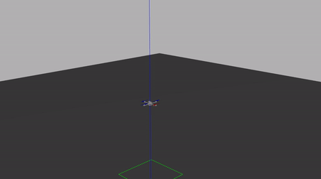

# Hummingbird_pkg

**Hummingbird_pkg** is a rospy based reinforcement learning component of the reinforcemencement learning based quadrotor controller training framework.

Hummingbird_pkg cannot be used as a standalone package, it must be running within the pre-settings. The following dependencies are the prerequisites to initiate the training:

- [ROS noetic]
- [RotorS]
- [Openai_ros]
- [Stable baselines3]

## Fault-Tolerant Quadrotor Controller

For my Master Thesis, I have used **Hummingbird_pkg** to configure the environment settings for my training environment (e.g., terminal conditions, observations and actions). The schematics of the overall training environment is shown below:


The trained controller can adjust itself to single rotor failure while hovering:



Please refer to the thesis for further details:

If you are willing to cite this research for your publication, please cite:

```bibtex
@masterthesis{Kim2022,
    author = {Kim, Taehyoung and Armanini, Sophie},
    institution = {Technical University of Munich},
    type = {diplomathesis}, 
    title = {Fault-Tolerant Quadrotor Controller Design Using Deep Reinforcement Learning},
    year = {2022},
}
```
## Installation

TO BE UPDATED

```sh
cd dillinger
npm i
node app
```

For production environments...

```sh
npm install --production
NODE_ENV=production node app
```

## Acknowledgement
I want to express my gratitude to many researchers who provided the simulator and package as open-source, making the research possible

## License
MIT

[//]: # (These are reference links used in the body of this note and get stripped out when the markdown processor does its job. There is no need to format nicely because it shouldn't be seen. Thanks SO - http://stackoverflow.com/questions/4823468/store-comments-in-markdown-syntax)
    
   [ROS noetic]: <http://wiki.ros.org/noetic>
   [RotorS]: <https://github.com/ethz-asl/rotors_simulator>
   [Openai_ros]: <https://bitbucket.org/theconstructcore/openai_ros.git>
   [Stable baselines3]: <https://github.com/DLR-RM/stable-baselines3>
